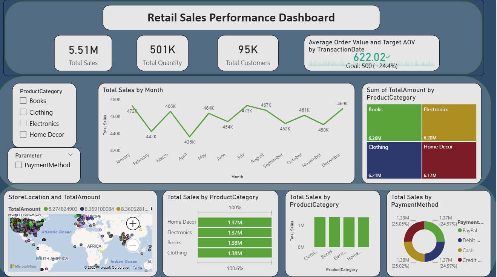

# Retail Sales Performance Dashboard

## Overview
This project analyzes retail sales performance using Power BI. The dashboard provides insights into sales trends, profitability, customer behavior, and product performance.

## Tools Used
- Power BI
- Excel
- Data Analysis

## Key Insights
- Identified top-performing product categories
- Analyzed regional sales and profit trends
- Compared sales performance across different segments
- Created interactive visualizations for business decision-making

## Files
- dashboard_retail_transaction-powerbi.pbix

## Author
Aryasree V R
## Dashboard Preview

